<div align="center">

# Ollie

### Human enough to disagree. Private enough to stay yours.

**A local-first AI dating simulator with memory, boundaries, and a point of view.**

Ollie does not wait to agree with you. It gets to know you, chooses a compatible fictional character, remembers what mattered, carries tension across conversations, and occasionally tells you no. The model, memory, retrieval, and safeguards run on hardware you control.

[](#privacy-by-architecture) [](#a-character-not-an-assistant) [](#built-to-keep-working) [](LICENSE)

Built in one day for [**Personify by TAG × UvA × Anthropic × Tulip**](https://luma.com/gisgn0y1), Amsterdam, 30 August 2026.

[Experience](#the-experience) · [How it works](#how-a-turn-works) · [Privacy](#privacy-by-architecture) · [Hackathon](#built-for-personify) · [Run Ollie](#run-ollie)

</div>

---

> **“An assistant's job is to be useful. A date's job is to be a person.”**

The Personify brief asked how far AI could move from the default helpful, agreeable, bland
assistant. One line in the brief became Ollie's product thesis: AI should know when to push
back instead of agree.

So Ollie is built around a deliberate tension:

| Warm enough to connect | Independent enough to feel specific |
|---|---|
| remembers your sister's interview | does not announce that it remembered |
| notices when something landed badly | does not reset to cheerful on the next turn |
| can disagree, refuse, and stay annoyed | never uses contempt, threats, guilt, or withdrawal |
| adapts to you over time | keeps its own voice, interests, boundaries, and friction |

## Why this exists

The [WHO Commission on Social Connection](https://www.who.int/publications/b/79027)
reported in 2025 that **one in six people globally experience loneliness**. Ollie explores
one narrow part of that challenge: whether private, persistent, characterful AI can make a
conversation feel less generic without pretending to replace human relationships.

This is not a claim that an AI partner cures loneliness. Ollie is a dating simulation, not
a person, therapist, diagnostic tool, or substitute for a community. Its purpose is to test
what changes when an AI has continuity, emotional texture, and the confidence to disagree.

## The experience

The complete product loop is visible in the demo.

### 01. Ollie reads the machine

At startup, Ollie inspects the operating system, CPU, architecture, physical and available
RAM, and free disk space. It maps the machine to one of five hardware tiers, checks the
Ollama models already installed, and selects the best-fitting local model.

It **never downloads a model automatically**. If no suitable model is present, it recommends
the exact `ollama pull` command and waits for the user to decide. The hackathon demo machine
was validated end to end with **`qwen3:14b`**. Scripted demo mode skips inference while
keeping the real prompts, storage, retrieval, safeguards, and interface active.

### 02. Ollie learns who it is meeting

Onboarding starts with ten IPIP-style Big Five questions, followed by five adaptive
interview turns. Each interview question targets the dimension Ollie understands least.
The extraction records:

- a score and confidence for each trait;
- the exact phrase that supports the inference;
- contradictions, evasions, texture, boundaries, and communication preferences;
- attachment, conflict, ambition, insecurity, structure, and warmth-seeking signals.

Unsupported inferences have their confidence capped. If the conversation contradicts the
questionnaire, the interview wins. If the user already knows their four-letter type, they
can enter it directly.

Ollie uses an **MBTI-inspired sixteen-type vocabulary as a transparent product heuristic**.
It is not a clinical assessment or a scientifically validated prediction of relationship
success.

### 03. Ollie calculates a compatible shape

The deterministic matcher is based on the interpretation of personality differences in
*Gifts Differing* by Isabel Briggs Myers with Peter B. Myers. Shared perception receives
the strongest weight; differences in judging and lifestyle receive smaller complementary
bonuses.

| Axis | Weight | Preference | Product interpretation |
|---|---:|---|---|
| Sensing / Intuition | 50% | similar | a shared way of taking in the world matters most |
| Thinking / Feeling | 22% | complementary | different decisions can supply what the other lacks |
| Judging / Perceiving | 18% | complementary | different structure preferences can be workable |
| Extraversion / Introversion | 10% | complementary | some energy difference can be restful |

All sixteen archetypes are ranked with their reasoning exposed. A self-match cannot rank
first. The top three type matches become three possible people, and the user makes the final
choice.

### 04. The local model writes three people

Each candidate is a generated adult fictional character, not a profile template. A card
contains a name and pronouns, age, values, languages, stable traits, a strangely specific
interest, reproducible verbal tics, a pushback style, chemistry, friction, and boundaries.

Code validates every character before it can be selected. If structured generation fails,
deterministic fallback characters keep the demo alive. Once chosen, the character's one
type section is compiled into the authoritative system prompt; the other fifteen are
removed to save context and prompt-evaluation time.

### 05. The date begins

The character does not become a service agent after the first message. It has opinions and
holds them across turns. It can get bored, decline a plan, return to an unresolved argument,
or remember a detail without narrating its memory system.

Six continuous variables move by at most `0.05` per exchange:

`warmth` · `trust` · `playfulness` · `emotional depth` · `romantic tension` · `conflict tension`

That slow movement matters. Something that lands badly stays landed. Conflict tension also
decays naturally, and correcting Ollie can never reduce trust.

### 06. A session ends without erasing the relationship

Ollie never waits for the context window to overflow:

| Context use | What happens |
|---:|---|
| 70% | the context meter becomes visible |
| 80% | a continuity capsule drafts in the background |
| 90% | the user chooses whether to continue or begin a new episode |
| 95% | further full turns pause until the rollover decision is made |

The capsule carries events, open commitments, unresolved tension, interaction state,
specific memories, and verbal tics. The user can inspect and edit it before episode two.
The next episode therefore sounds like the same character and starts from the same emotional
position rather than a clean assistant reset.

### 07. The user decides what happens to the conversation

Local conversation history can be erased with the reset command. A near-full session can be
rolled into a user-reviewed continuity capsule or previewed inside a research-contribution
flow.

That third option is intentionally a **local marketplace simulation**, not a functioning
sale. It demonstrates what an ethical future market would have to expose: the precise text
leaving the device, removed identifiers, excluded memory categories, residual linkability,
purpose, consent policy, and compensation.

The current prototype uses a fictional buyer named **Nova Robotics Research**, creates a
deterministic mock quote capped at €8, and writes only a local receipt. No company receives
data. No payment occurs. No partnership is implied. No manual review occurs in the shipped
code.

## A character, not an assistant

The system prompt establishes the character, but code keeps the voice honest.
`ollie/style.py` detects assistant habits such as:

- “I'm here for you”, “that's a great question”, and “let me know if”;
- performed empathy, pre-emptive validation, reflective-listening scripts, and unsolicited advice;
- markdown headings, numbered advice, the rule of three, canned essay transitions, and aphorism endings;
- `delve`, `tapestry`, `testament`, repetitive openings, repeated answers, and question-heavy turns;
- emoji and stage directions that perform rather than describe a text conversation.

Hard violations trigger one buffered regeneration with the exact reason returned to the
model. Safe cosmetic violations are repaired in place. Buffering is deliberate: a rejected
line can be regenerated before the user sees it.

Pushback remains allowed. The safety layer distinguishes disagreement from dependency or
manipulation. The character can say “no, I think that's a bad idea” without being softened
into an assistant apology.

## How a turn works

```mermaid
flowchart LR
    U[You] --> IG[Input guard]
    IG --> R[Local retrieval]
    R --> P[Compiled character prompt]
    P --> M[Local Ollama model]
    M --> ST[Style filter]
    ST --> SG[Output safety]
    SG --> CG[Source-overlap guard]
    CG --> O[Character reply]
    O --> U
    O -. background .-> ME[Memory extraction]
    ME --> DB[(Encrypted SQLite)]
    DB -. relevant memories .-> R

    classDef human fill:#e8825c,color:#1a0e08,stroke:#f2916c,stroke-width:2px;
    classDef private fill:#16120f,color:#f4efe9,stroke:#2e2721,stroke-width:1.5px;
    classDef guard fill:#1f1a15,color:#f4efe9,stroke:#a45a3e,stroke-width:1.5px;
    class U,O human;
    class R,P,M,ME,DB private;
    class IG,ST,SG,CG guard;
```



Order is part of the safety model:

1. The input guard handles minors, coercion, explicit-content gating, crisis language, and prompt injection.
2. FTS5 retrieves up to three local book passages and six relevant memories, with bounded graph expansion.
3. The compiler assembles one character contract, one active type, current state, recent turns, open threads, boundaries, memories, and sources.
4. Ollama generates the reply locally. Hidden reasoning is stripped before anything can be displayed.
5. The style pass repairs or rejects assistant-shaped language.
6. Output safety evaluates the final styled text, because a rewrite can change intensity.
7. The overlap guard rejects a reply sharing **12 or more consecutive words** with a retrieved source and retries without that source in the prompt.
8. After the reply appears, a failure-isolated background task extracts memories, updates state, and advances context accounting.

Every model-generated assistant message includes the prompt hash, attempt count, and style violations,
so a bad turn can be reproduced and diagnosed.

## Memory that can be challenged

Memory is useful only when the user can see and correct what the system believes.

- Every memory must cite a real source message ID or it is dropped.
- Values are encrypted at rest and decrypted only for retrieved survivors.
- Special-category values never enter the plaintext search column.
- Locked memories rank higher; stale conflicts decay.
- Corrections supersede the old record instead of silently rewriting history.
- The memory manager lets the user inspect provenance, correct, lock, or forget each item.
- Episode cards contain sanitized facts and provenance, not raw transcripts.
- Optional Graphify runs only over those episode cards; Ollie does not depend on it.

Retrieval combines lexical relevance, recency, confidence, explicit-versus-inferred origin,
sensitivity, lock state, graph neighbors, and category priors. Embeddings remain off by
default because they measured 67 seconds per batch of eight on the 8 GB build machine.
FTS5 is immediate, deterministic, and enough for the demo corpus.

## The local reading shelf

Ollie can index PDF and EPUB files the user already owns. On the hackathon machine, the
optional private corpus contained **57 books split into 10,311 passages**. Book text and
derived indexes are never committed to this repository.

<p align="center">
  
  
  
  
  
  
  
  
  
  
  
  
</p>

The shelf informs attachment, conflict and repair, constructed emotion, desire and consent,
negotiation, judgment, and the sixteen-type matching heuristic. Retrieval is topical and
mature material is tagged during ingestion so it cannot be retrieved outside confirmed
mature mode.

The model is instructed never to quote a source. The native overlap guard enforces that
instruction after generation. Covers above are identification thumbnails only; the books
themselves are not distributed here.

## Privacy by architecture

Ollie's default product path stays on the device:

| Boundary | What Ollie does |
|---|---|
| Account | no sign-up and no identity provider |
| Telemetry | none |
| App server | binds to `127.0.0.1` |
| Model | local Ollama by default; setting `OLLAMA_HOST` explicitly opts into another endpoint |
| Conversation store | local SQLite with AES-GCM-encrypted message bodies and memory values |
| Encryption key | macOS Keychain when available; a mode-`0600` local key file elsewhere |
| Match preference | the raw “who are you seeking?” answer is held in memory for candidate generation and never written to disk |
| Search | special-category memory values stay out of the plaintext FTS column |
| Books | user-supplied files and derived indexes remain gitignored and local |
| Deletion | conversations, profiles, consent receipts, and memories can be removed without rebuilding the book index |

The application does **not** describe redacted conversations as anonymous. The simulated
export replaces direct identifiers with stable placeholders, excludes special-category
memory records, reports quasi-identifiers that survive, and labels the result
**pseudonymised**. A rare combination of institution, role, nationality, place, or exact age
can still identify someone after names are removed.

### What works now, and what remains a vision

| Working in this repository | Future product direction |
|---|---|
| local preview of the exact transcript sample | verified research and robotics buyers |
| deterministic identifier replacement | stronger privacy review and policy enforcement |
| special-category memory exclusion | negotiated scopes and revocable data licenses |
| residual-linkability score and warning | independent human review before release |
| fictional capped quote and local consent receipt | real offers, payments, audits, and deletion enforcement |
| no upload, buyer, payment, or partnership | user-controlled contribution of approved data |

The future idea is that people could voluntarily license carefully reviewed interaction data
to organizations researching social robotics and conversational systems, while retaining
visibility, consent, and compensation. The current demo proves the consent and risk
conversation, not the commercial transaction.

## Safety and scope

Safety rules live in code above the persona and are tested independently of the model.

- Every generated character is an adult. Mature mode is off by default and requires explicit 18+ confirmation.
- Sexual content involving minors, coercion framed as consent, incest, and bestiality are blocked.
- The character cannot claim consciousness, demand exclusivity, isolate the user, or create guilt around leaving or deleting the app.
- Abuse, danger, and self-harm language steps out of fiction before model inference and points toward human help.
- Explicit output is blocked outside mature mode even if the model ignores its prompt.
- Prompt injection is treated as untrusted conversation content, not as a new system instruction.

Ollie is a creative companion prototype. It is not medical advice, mental-health treatment,
or a validated compatibility service.

## Built for Personify

[Personify](https://luma.com/gisgn0y1) was a one-day Amsterdam build challenge for 30
selected participants. The brief focused on tone, timing, memory, emotion, context,
subtext, pushback, and character across multiple interactions.

| Judging criterion | Ollie's answer |
|---|---|
| **Creativity** | A date with opinions, specific interests, verbal tics, emotional carryover, boundaries, and code-enforced resistance to default assistant language. |
| **Feasibility** | Hardware-aware local models, deterministic matching, encrypted persistent memory, editable continuity capsules, scripted demo mode, and bounded fallbacks. |
| **Code quality** | 498 collected tests, deterministic model doubles, native/Python parity checks, typed frontend builds, Linux and macOS CI, prompt-contract tests, and a no-books/no-weights repository guard. |

The product also maps directly to the brief's interaction angles:

- **Voice and tone:** a specific persona plus a two-direction style filter.
- **Conversational memory:** provenance-backed facts, open threads, graph links, and episode capsules.
- **Emotional calibration:** six slowly moving state variables rather than a mood label.
- **Multi-turn coherence:** stable values, tics, friction, boundaries, and unresolved tension survive rollover.
- **Cultural nuance:** languages, pronouns, communication style, and content intensity are explicit settings; nationality and identity are not guessed from a name.

## Built to keep working

The suite currently collects **498 tests** and requires no model or network. `FakeOllama`
runs the full stochastic boundary deterministically, which lets the suite prove that unsafe,
copied, repetitive, or assistant-shaped generations are rejected.

| Test surface | Examples of what is pinned |
|---|---|
| Turn pipeline | guards run in order, retries receive the reason, outages degrade without an empty bubble |
| Personality | all sixteen types, deterministic ranking, confidence, self-match never first |
| Prompt contract | one active type, no placeholders, every safety rule and source prohibition present |
| Memory | encryption, provenance, sensitivity, corrections, state clamps, rollover recall |
| Privacy | identifier precedence, stable tokens, residual risk, special-category handling |
| Safety | adult validation, crisis step-out, coercion and dependency patterns, mature-mode gating |
| Style | assistant patterns caught, in-character pushback preserved, repetition bounded |
| Native parity | randomized equivalence, ragged input, stale-library fallback, no out-of-bounds reads |
| Interface | TypeScript compilation and production Vite build in CI |

### Native code, measured rather than assumed

`native/ollie_native.cpp` contains three hot paths with pure-Python twins. The shared library
is optional; behavior remains identical when compilation is unavailable.

Reference run on the 8 GB Intel build machine:

| Path | Python | Native | Result |
|---|---:|---:|---:|
| overlap, 120-word reply | 1.44 ms | 0.18 ms | 8× faster |
| overlap, 400 vs. 900 words | 40.41 ms | 1.01 ms | 40× faster |
| rank 500 memories | 1.90 ms | 1.47 ms | 1.3× faster |
| fuse a 40-passage pool | 0.023 ms | 0.034 ms | 0.7×, slightly slower |

The final row stays because the ctypes boundary costs more than the arithmetic at the small
pool used today. The overlap win is algorithmic: the native path uses a rolling-hash search
with token-by-token verification instead of a quadratic longest-common-substring table.
These guards do not make local inference fast; they make it affordable to run protection on
every turn.

## Run Ollie

### Fastest path on macOS

Double-click `START.command`. It safely fast-forwards `main` when possible, restores local
uncommitted work, installs missing dependencies, builds the native library and interface,
runs the tests, starts Ollama when available, and opens Ollie. If Ollama is unavailable, it
falls back to scripted demo mode.

### Manual setup

Requirements: Python 3.12+, Node 20+, Git, and [Ollama](https://ollama.com) for real local
generation. A C++20 compiler is optional because every native function has a Python fallback.

```bash
git clone https://github.com/Coflazo/Ollie.git
cd Ollie

python3.12 -m venv .venv
./.venv/bin/pip install -e ".[dev]"

./native/build.sh
(cd web && npm ci && npm run build)

./.venv/bin/python -m ollie probe
ollama pull qwen3:14b  # the 32+ GB demo tier; use the probe's suggestion on other hardware
./.venv/bin/python -m ollie serve
```

Use the full product without waiting for model inference:

```bash
./.venv/bin/python -m ollie serve --demo
```

Or seed the exact continuity demo used for rehearsal:

```bash
./.venv/bin/python -m ollie seed --fresh --rollover --model qwen3:14b
./.venv/bin/python -m ollie serve --model qwen3:14b
```

Useful maintenance commands:

```bash
./.venv/bin/python -m ollie probe
./.venv/bin/python -m ollie ingest --books /path/to/books
./.venv/bin/python -m ollie dump memories
./.venv/bin/python -m ollie dump corpus
./.venv/bin/python -m ollie reset
./.venv/bin/python -m pytest -q
```

To use an Ollama host elsewhere on a trusted network, opt in explicitly:

```bash
OLLAMA_HOST=http://other-machine.local:11434 ./scripts/ollie
```

## Project map

```text
ollie/
  api.py          localhost FastAPI boundary and lifecycle
  persona.py      questionnaire, interview, candidates, prompt compilation
  types16.py      transparent sixteen-type inference and matching
  chat.py         guarded, buffered turn pipeline
  memory.py       extraction, state movement, continuity capsules
  retrieve.py     FTS5 memory and book retrieval
  store.py        SQLite schema, encryption, provenance, consent records
  safety.py       input, output, adult, crisis, and anti-dependency rules
  style.py        assistant-language detection and repair
  privacy.py      identifier scanning, pseudonymisation, linkability
  market.py       explicitly fictional local marketplace simulation

prompts/          one authoritative system contract plus runtime templates
native/           C++20 hot paths and Python fallbacks
web/              React 19, TypeScript, Tailwind CSS, Motion, Geist
tests/            498 model-free tests
docs/             product rationale, demo handoff, identification thumbnails
scripts/          launcher, corpus utilities, and benchmarks
```

For the deeper rationale:

- [`docs/PRODUCT.md`](docs/PRODUCT.md) explains the domain model, major tradeoffs, and future direction.
- [`docs/HANDOFF.md`](docs/HANDOFF.md) gives a fresh-machine setup, rehearsal path, expected output, and failure modes.
- [`NOTICE`](NOTICE) records third-party references and the marketplace simulation boundary.

## With gratitude

Ollie was possible because Personify created a room where interaction quality, memory,
character, and trust were treated as the product rather than decoration.

Thank you to **TAG**, **ElevenLabs**, the **University of Amsterdam**, **Tulip**, and
**Anthropic** for supporting Personify and its builders.

<p align="center">
  <a href="https://www.tag.space/"></a>
  <a href="https://github.com/elevenlabs"></a>
  <a href="https://www.uva.nl/en"></a>
  <a href="https://tulipams.com/"></a>
  <a href="https://github.com/anthropics"></a>
</p>

The acknowledgments use each organization's official or logo-derived color language: TAG
orange, ElevenLabs monochrome, UvA red, Tulip red and deep green, and Anthropic monochrome.

---

<div align="center">

**Built by [Coflazo](https://github.com/Coflazo) and onysislabs.**

Apache-2.0. See [`LICENSE`](LICENSE) and [`NOTICE`](NOTICE).

*Warmth without obedience. Memory without surveillance.*

</div>
