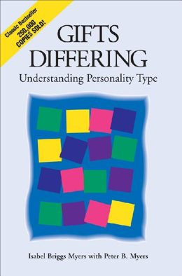
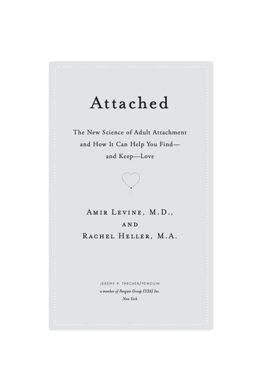
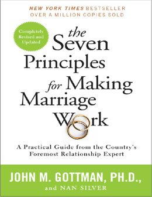
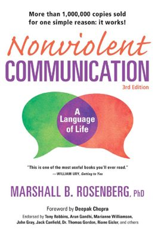
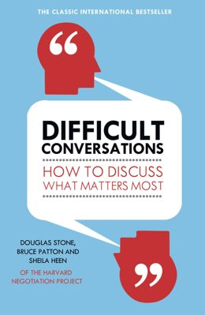
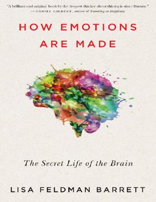
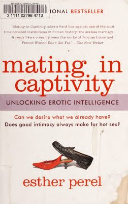
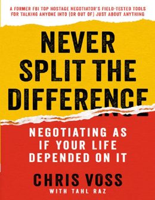
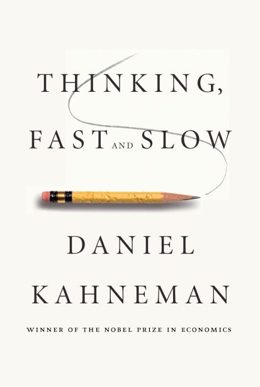
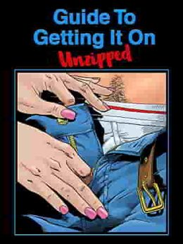

# Ollie

**A dating simulator that argues with you.**

Ollie interviews you, works out which of the sixteen personality types you are, picks the
type that would actually suit you, and becomes a specific person of that type. Then it
disagrees with you, gets bored, remembers what you said three weeks ago, and occasionally
tells you no.

Everything runs on your own machine. No account, no telemetry, no network call after setup.

Built in one day for **Personify**, TAG × UvA × Anthropic × Tulip, Amsterdam, 30 August 2026.

---

## The brief asked for push back. We built the whole thing around it.

Personify listed *"knowing when to push back instead of agree"* as one of the angles worth
exploring. Most companion products treat that as a rough edge to sand off. We treated it as
the product.

An assistant's job is to be useful. A date's job is to be a person. Every design decision
below follows from that one sentence.

The character has opinions and keeps them when you disagree. It holds a position across
turns, because caving in one message reads as having no interior. It has its own agenda for
the conversation. It gets bored and says so. It can be disappointed in you and stay
disappointed for a while, since a reset button is not a person. It says no to plans, topics,
and questions it does not feel like answering.

What it never does: contempt, threats, punishment, or withdrawal used as leverage. It argues
like someone who intends to still be there afterwards.

---

## Choosing who you get



The matching runs on *Gifts Differing* (Isabel Briggs Myers with Peter B. Myers), and one
argument in it does most of the work.

Myers treats the perceptive function, sensing versus intuition, as the preference that most
determines whether two people can understand each other at all. Partners who take in the
world differently are, in a real sense, describing different worlds to each other. The
judging preferences and the lifestyle preference she treats very differently: those
differences are workable, and frequently useful, because each person supplies what the other
lacks.

So the scorer weights sensing/intuition heavily toward **similarity**, and gives the other
three axes a mild **complementarity** bonus. That single asymmetry produces every match in
the product.

```python
_WEIGHTS = {
    "EI": (0.10, "complement"),   # some difference is restful, not decisive
    "SN": (0.50, "same"),         # shared perception makes understanding possible
    "TF": (0.22, "complement"),   # different judging functions supply what the other lacks
    "JP": (0.18, "complement"),   # workable difference, and often useful
}
```

INFJ gets matched to ENTP. ESTJ gets matched to ISFP. No type is ever matched to itself,
because a dating simulator that pairs everyone with a clone is not simulating dating. You
see all sixteen ranked with the reasoning attached, and you pick from the top three.

`tests/test_types16.py` pins this reading of the book. One test asserts that the best match
always shares the perception axis; another asserts that same-perception-opposite-judging
beats same-perception-same-judging. If someone later tunes the weights into something Myers
would not recognise, those tests fail.

It is a heuristic drawn from a book, not a verdict about your real romantic life, and the
interface says so.

---

## How it gets to know you first

**Ten questions, then a real conversation.** The questionnaire gives a cheap Big Five
estimate. Then Ollie interviews you for five turns, adaptively. Each question aims at
whichever trait it knows least about, and it notices what you route around.

It reads for the things a form cannot capture: whether you are anxious, ambitious, insecure,
conflict-avoidant, need the plan settled, expect to be found wanting. Every score has to
quote the fragment of your own words that produced it. A score with no supporting quote gets
its confidence capped, in code, because an inference you cannot audit is an inference you
cannot correct.

Where the interview contradicts the questionnaire, the interview wins. People answer forms
as who they wish they were.

**Then the type**, estimated from both, with its confidence shown per axis. If you already
know your four letters, enter them and skip the guessing entirely.

**Then the person.** Not a profile. A character with an oddly specific obsession they go too
long about, two or three verbal tics that persist across sessions, a defined way of arguing,
and concrete places where you and they will rub.

---

## The library it reads

Ollie indexes 57 books you supply yourself, 10,311 passages, all local. They are never
quoted and never redistributed. They shape how the character reads a situation, the way
having read something shapes anyone.

Retrieval is topical: a message about distance pulls attachment writing, a message about a
fight pulls repair writing. The books below are the ones that carry the most weight.

<table>
<tr>
<td width="110"></td>
<td><strong>Attached</strong> · Levine and Heller<br>
Attachment styles are the backbone of the interview scoring. The anxious and avoidant
dimensions in <code>persona.py</code> come from here, and the character's reaction to
distance is drawn from the same material.</td>
</tr>
<tr>
<td></td>
<td><strong>Hold Me Tight</strong> · Sue Johnson<br>
Where the repair behaviour comes from. Johnson's demand-withdraw cycle is why conflict
tension decays slowly instead of resetting, and why a character who was hurt stays hurt for
several turns.</td>
</tr>
<tr>
<td></td>
<td><strong>The Seven Principles for Making Marriage Work</strong> · Gottman and Silver<br>
Contempt is the one thing the character is never allowed to do, and Gottman is the reason.
The repair-attempt idea is why pushback always leaves a route back.</td>
</tr>
<tr>
<td></td>
<td><strong>Nonviolent Communication</strong> · Marshall Rosenberg<br>
Used inverted. Rosenberg's observation-versus-evaluation split informs how the character
disagrees without turning it into a character judgement. Its therapeutic register is on the
banned list in <code>style.py</code>: the character never says "it sounds like you're
feeling."</td>
</tr>
<tr>
<td></td>
<td><strong>Difficult Conversations</strong> · Stone, Patton and Heen<br>
The three-conversations model is why the character can hold a disagreement about the facts
and the feelings separately, rather than collapsing both into an apology.</td>
</tr>
<tr>
<td></td>
<td><strong>How Emotions Are Made</strong> · Lisa Feldman Barrett<br>
The reason interaction state is six continuous variables that drift rather than a label
picked from a list of six basic emotions. Barrett's constructed-emotion account is the
argument against a mood dropdown.</td>
</tr>
<tr>
<td></td>
<td><strong>Mating in Captivity</strong> · Esther Perel<br>
Perel's argument that closeness and desire pull against each other is why romantic tension
is a separate axis from warmth, and why maxing out warmth does not maximise everything else.</td>
</tr>
<tr>
<td></td>
<td><strong>Come As You Are</strong> · Emily Nagoski<br>
Responsive versus spontaneous desire, and context as the thing that governs both. Informs
mature mode's pacing and why intensity is a setting rather than an escalator.</td>
</tr>
<tr>
<td></td>
<td><strong>Never Split the Difference</strong> · Voss and Raz<br>
Tactical empathy and labelling, used for how the character reads what you are avoiding
rather than for persuading you of anything.</td>
</tr>
<tr>
<td></td>
<td><strong>Thinking, Fast and Slow</strong> · Daniel Kahneman<br>
Behind the confidence discipline in memory extraction. Explicit statements are cheap to
trust; inferences are where a system talks itself into things, so they cap at 0.65 and get
flagged for confirmation.</td>
</tr>
<tr>
<td></td>
<td><strong>The Guide To Getting It On</strong> · Paul Joannides<br>
Consent as ongoing and checkable, which is how the mature-mode contract is written: consent
is confirmed in character, and withdrawing it stops the scene without negotiation.</td>
</tr>
</table>

Covers are shown at thumbnail size to identify the works being discussed. The books
themselves are not in this repository and never will be. Folders 05 and 06 are tagged
explicit at ingest time and cannot be retrieved outside mature mode.

---

## How we answered each judging criterion

### Creativity: distance from the default assistant

Sounding human is enforced in code, not hoped for in a prompt. `ollie/style.py` holds the
machine phrases as patterns with severities: *"I'm here for you"*, *"that's a great
question"*, *"let me know if"*, the rule of three, "it's not just X, it's Y", `delve`,
`tapestry`, `testament`, more than one em dash, and four replies in a row ending in a
question. Hard matches are rejected and regenerated with the reason named back to the model.
Soft ones are repaired in place.

It costs about 3 ms. A second LLM rewrite pass would cost roughly 15 s on a 3B model, and, a
larger problem, a regex cannot accidentally soften a refusal, alter content intensity, or
invent a fact the way a rewrite pass can.

The test file runs it in both directions: every machine phrase must be caught, and every
blunt in-character line must *not* be. A filter with false positives would sand the
character down into exactly the voice it exists to prevent.

*(This README is held to the same rule. Zero em dashes.)*

### Feasibility: does it keep working across multiple interactions

Ollie never waits for the context window to fill. At 70% a meter appears, at 80% a continuity
capsule drafts in the background, at 90% you choose, at 95% further full requests are
blocked, because a summary written against a full window is a bad summary.

The capsule is structured, not a vague paragraph. It carries what actually happened, what is
still unresolved between you, the commitments left open, the two or three specific things it
would be strange to forget, and the verbal tics that have to persist so episode two sounds
like the same person rather than a soundalike. If you ended on friction, episode two starts
on friction. You review and edit it before it is used.

Underneath, SQLite is the authoritative store. Every memory must cite a real message ID. One
that does not exist gets dropped, because an unattributable memory is the model inventing
history. Interaction state moves in clamped increments of at most 0.05 per message, conflict
tension decays on its own, and a correction can never cost you trust. Being corrected is how
trust gets built; punishing it teaches you to lie.

`tests/test_memory.py` proves the loop: establish a fact in episode one, roll the context,
open episode two, assert the fact is still there and the open thread survived.

### Code quality

330 tests, no network required. A `FakeOllama` test double runs the entire turn pipeline
without inference, which is the only way to assert deterministic things about a stochastic
system. You can prove that a reply containing "I'm here for you" gets rejected and
regenerated.

The C++ module has a pure-Python twin for every function and a randomised parity test across
seventy generated cases. If the shared library never builds, Ollie behaves identically and
runs slightly slower. Safety rules live in code above any persona, so an under-18 character
cannot exist regardless of what a model proposes.

---

## The other angles

**Conversational memory:** the character never announces that it remembered something. It
just uses it, the way people do. Not *"I remember you mentioned your sister"* but *"how'd it
go with your sister."*

**Emotional calibration:** mood moves a little per message, never a lot. Something that lands
badly stays landed for several turns. Snapping instantly back to warm is the tell of a
machine.

**Multi-turn coherence:** the verbal tics are the mechanism. They are carried explicitly in
the continuity capsule, and they are what makes identity auditable across a rollover.

**Cultural nuance:** language, pronouns, directness and affection are explicit profile
dimensions the user sets, never inferred from a name or a nationality.

---

## How it works

```
you ──► input guard ──► retrieval ──► compiled prompt ──► local model
                                                              │
     you ◄── style filter ◄── safety guard ◄── copyright guard
                    │
                    └──► background: memory extraction, interaction state
```

Order matters. The style pass runs before the safety pass, because a rewrite can change
intensity and safety has to see the final text. Generation is buffered rather than streamed
straight to the screen: a rejected reply costs one regeneration, but a rejected reply you
already read costs the demo.

| Layer | Choice | Why |
|---|---|---|
| Model | Any Ollama tag | Probes your hardware, picks a tier, uses the best model you already have. Never downloads without asking. |
| Memory | SQLite + AES-GCM | Authoritative and ordered. Message bodies and memory values encrypted, key in the macOS Keychain. |
| Retrieval | FTS5 + fused signals | Instant and deterministic. Embeddings measured at 67s per batch of 8 on the 8 GB build machine, so they are off by default. |
| Native | C++20, no CMake | Copyright-overlap guard and retrieval fusion. One `clang++` invocation, one file. |
| Interface | React, Tailwind, motion, Geist | Seven screens. Warm, low-light, private. The opposite of a swipe deck. |

`ollie_longest_overlap` blocks any reply sharing more than twelve consecutive words with a
source, then regenerates it with the sources removed from the prompt. A model that has
started reciting will recite again if it can still see the text.

### What the native code actually buys

`scripts/benchmark.py` measures each native path against its Python twin, because "we used
C++ so it is fast" is not a claim anyone should accept without a number. On the 8 GB Intel
build machine:

| Path | Python | Native | |
|---|---|---|---|
| Copyright guard, 120-word reply vs a retrieved passage | 1.44 ms | 0.18 ms | 8x |
| Copyright guard, 400 vs 900 words | 40.41 ms | 1.01 ms | 40x |
| Memory ranking, 500 stored memories | 1.90 ms | 1.47 ms | 1.3x |
| Retrieval fusion, 40-passage pool | 0.023 ms | 0.034 ms | 0.7x |

The overlap win is algorithmic rather than linguistic. The obvious implementation is the
longest-common-substring dynamic program at O(n·m); the native one binary searches the
answer, since "a shared run of length L exists" is monotone in L, and settles it in
O((n+m) log n) with rolling hashes. Every hash hit is verified token by token, so a
collision can cost time but can never produce a wrong answer.

The last row is the honest one: at the pool size retrieval actually uses, the native fusion
is marginally *slower* than Python, because crossing the ctypes boundary costs more than
the arithmetic saves. It is kept because the difference is eleven microseconds and the same
code path serves any scale. Memory ranking only became worth crossing for once the term
matching moved across too; an earlier version that passed precomputed counts and did only
the multiply-adds measured 0.4x, and that result is why the current one looks the way it
does.

None of this makes a reply arrive sooner. The model dominates. What it buys is running
the guards on every single turn instead of sampling them.

---

## Running it

Needs Python 3.12+, [Ollama](https://ollama.com), and Node 20+.

```bash
git clone https://github.com/Coflazo/Ollie.git && cd Ollie
python3 -m venv --system-site-packages .venv
./.venv/bin/pip install -e .

ollama pull qwen2.5:3b-instruct-q4_K_M   # or anything larger you can run

./scripts/ollie                           # builds what it needs, then opens the browser
```

Run the model on another machine on your network:

```bash
OLLAMA_HOST=http://other-machine.local:11434 ./scripts/ollie
```

Other commands:

```bash
./.venv/bin/python -m ollie probe                          # hardware and chosen tier
./.venv/bin/python -m ollie ingest --books /path/to/books  # index your own library
./.venv/bin/python -m ollie dump memories                  # decrypt records for debugging
./.venv/bin/python -m ollie reset                          # delete every conversation
./.venv/bin/python -m pytest                               # 330 tests
```

---

## What it isn't

Not a therapist, not a substitute for people, not a compatibility test, not a real person.

The character never claims consciousness, never says only it understands you, never
discourages you from seeing anyone, never demands exclusivity, and never guilts you for
closing the app or deleting it. Those are patterns in `ollie/safety.py`, enforced above any
persona, and tested.

If you describe abuse, danger, or self-harm, Ollie drops the fiction immediately, before the
model is even called. It says plainly that it is a character in an app and cannot help the
way a person could, then points you at someone who can.

Mature mode is off by default, requires an explicit 18+ confirmation, and everyone in every
scene is an adult by construction. Validated in code, not requested in a prompt.

---

## Privacy

Local by default and testably so. Run it with Wi-Fi off and nothing changes.

The research-contribution screen is a **simulation**. The buyer is fictional, no request is
made, no payment is processed, and every artifact it writes says so on its face. It exists to
make an argument about who should own this data, not to move any.

One claim it deliberately does not make: stripping names produces *pseudonymised* text, not
anonymous text. A romantic conversation carries special-category data under GDPR Article 9,
and a rare combination of job, city and age can identify someone with every name already
removed. The interface says this too, in those words.

---

## Repository

No book text, no model weights, no conversation logs. The corpus pipeline reads files you
already have and writes indexes into a gitignored directory.

```
ollie/       engine: persona, types16, memory, retrieval, safety, style, privacy
prompts/     the voice: immutable contract, character core, runtime templates
native/      C++20 hot paths, each with a Python twin
web/         React interface
tests/       330 tests, no network required
docs/covers/ thumbnails for this document
```

Two longer documents sit in `docs/`:

- [**HANDOFF.md**](docs/HANDOFF.md) walks through setting up and verifying the whole product
  on a fresh machine, step by step, with the expected output and the failure mode at every
  stage. Read section 6 if you only read one thing: it is the flow that most needs a human
  to watch it.
- [**PRODUCT.md**](docs/PRODUCT.md) is the long version of this README. Why each module is
  shaped the way it is, the decisions that could have gone the other way, and where the
  product goes after the hackathon.

Apache-2.0. See `LICENSE` and `NOTICE`.

Built by [Coflazo](https://github.com/Coflazo) and onysislabs.
